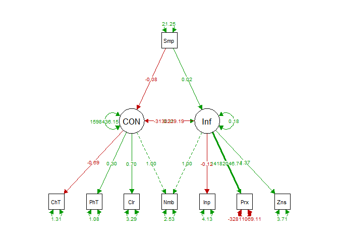
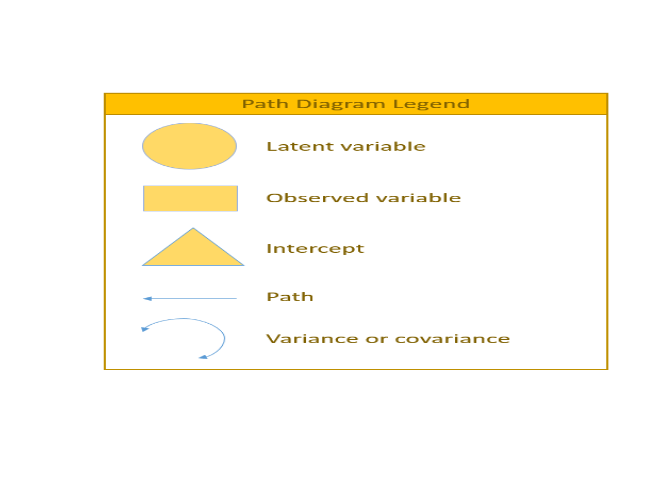
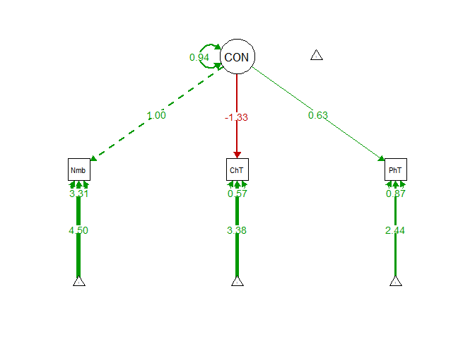
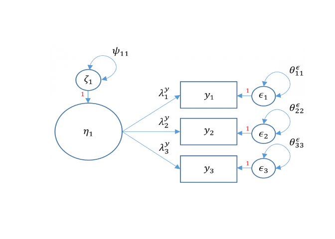
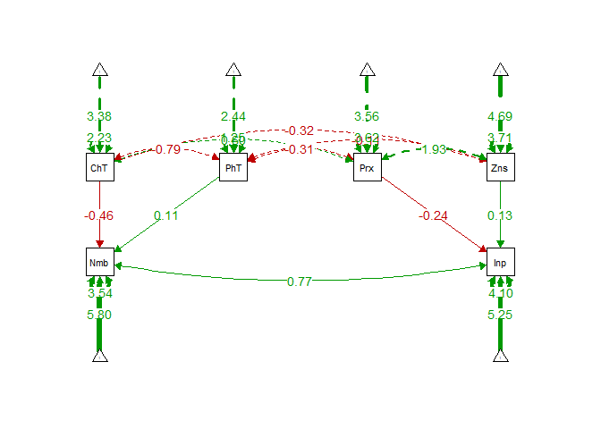
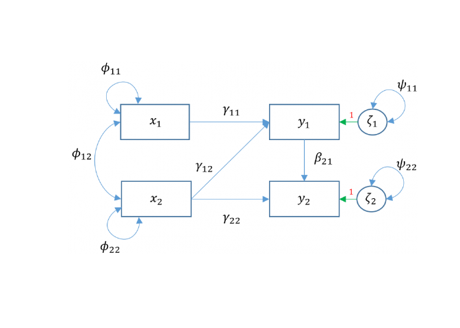

R Final
================

This is a series of predictive models looking at how external factors
(observable variables) correlate with concentration and influence of
microplastics (latent variables). These models utilize structural
equation modeling and the “lavaan” package to produce path analysis
plots to examine the direction and strength of the relationship between
variables. for more information follow these links

Lavaan package (<https://lavaan.ugent.be/>) Sem package
(<https://cran.r-project.org/web/packages/sem/sem.pdf>)

``` r
#loading in required packages
library(lavaan)  #for performing the CFA
library(semPlot)  #for plotting your CFA
library(dplyr)  #for subsetting data 

#setting working directory
setwd("C:/Users/Bryce Bonilla/Desktop")

#reading in data
semdata <- read.csv("GIS_R_Micro.csv")
#add column names
names(semdata) <- c("Sample","Number","ChemType","PhysType","Color","Date","Lat","Lon","Inputs","Proximity","Zones")
head(semdata)  #view data file to see what data is pulled in
```

    ##   Sample Number ChemType PhysType Color       Date               Lat
    ## 1    TC1      2     PMMA    Fiber  Blue 11/21/2021 N 35°57'18.3996"
    ## 2    TC2      4      PET   Pellet Green 11/21/2021 N 35°57'12.3408"
    ## 3    TC3      6       PC   Pellet   Red 11/21/2021 N 35°57'14.4144"
    ## 4    TC4      8      PET   Pellet   REd 11/21/2021  N 35°57'15.7068
    ## 5    TC5      4       PP    Fiber   REd 11/21/2021  N 35°57'12.1104
    ## 6    TC6      3      PET    Fiber   RED 11/21/2021  N 35°57'06.1992
    ##                 Lon Inputs Proximity Zones
    ## 1 W 83°56'53.0772"      6         3     3
    ## 2 W 83°56'46.2588"      5         2     4
    ## 3 W 83°56'43.0008"      4         3     5
    ## 4 W 83°56'34.7352"      8         4     3
    ## 5 W 83°56'30.3612"      3         5     7
    ## 6 W 83°56'27.3264"      6         3     8

# Model fit 1 Structural Regression Model

``` r
#Creating the sem model with latent variables
#Creating predictor variables by regression of latent variables
sem.model.measurement <- "CON =~ 1*Number + ChemType + PhysType + Color
Infl =~ 1*Number + Inputs + Proximity + Zones
CON ~ Sample + Infl
Infl ~ Sample + CON"

#attaching model to sem and reading data
sem.fit.measurement <- sem(sem.model.measurement, data = semdata)
#summarizing model and plotting
summary(sem.fit.measurement, fit.measures = TRUE)
```

    ## lavaan 0.6-9 did NOT end normally after 256 iterations
    ## ** WARNING ** Estimates below are most likely unreliable
    ## 
    ##   Estimator                                         ML
    ##   Optimization method                           NLMINB
    ##   Number of model parameters                        19
    ##                                                       
    ##                                                   Used       Total
    ##   Number of observations                            16          19
    ##                                                                   
    ## Model Test User Model:
    ##                                                       
    ##   Test statistic                                    NA
    ##   Degrees of freedom                                NA
    ## 
    ## Parameter Estimates:
    ## 
    ##   Standard errors                             Standard
    ##   Information                                 Expected
    ##   Information saturated (h1) model          Structured
    ## 
    ## Latent Variables:
    ##                    Estimate       Std.Err  z-value  P(>|z|)
    ##   CON =~                                                   
    ##     Number                 1.000                           
    ##     ChemType              -0.691       NA                  
    ##     PhysType               0.295       NA                  
    ##     Color                  0.702       NA                  
    ##   Infl =~                                                  
    ##     Number                 1.000                           
    ##     Inputs                -0.120       NA                  
    ##     Proximity       14182046.738       NA                  
    ##     Zones                  1.371       NA                  
    ## 
    ## Regressions:
    ##                    Estimate       Std.Err  z-value  P(>|z|)
    ##   CON ~                                                    
    ##     Sample                -0.075       NA                  
    ##     Infl            -3130229.192       NA                  
    ##   Infl ~                                                   
    ##     Sample                 0.015       NA                  
    ##     CON                    0.306       NA                  
    ## 
    ## Variances:
    ##                    Estimate       Std.Err  z-value  P(>|z|)
    ##    .Number                 2.532       NA                  
    ##    .ChemType               1.306       NA                  
    ##    .PhysType               1.077       NA                  
    ##    .Color                  3.290       NA                  
    ##    .Inputs                 4.125       NA                  
    ##    .Proximity      -32811069.109       NA                  
    ##    .Zones                  3.715       NA                  
    ##    .CON              1598436.153       NA                  
    ##    .Infl                   0.177       NA

``` r
semPaths(sem.fit.measurement, "par", edge.label.cex = .75, edge.label.position= .5, fade = FALSE)  #plot our CFA. you can change layout with layout = argument. see ?semPaths() for more. 
```

<!-- -->

``` r
#local image code path diagram for model 1
library("png")
pp <- readPNG("pathlegend1.png")
plot.new() 
rasterImage(pp,0,0,1,1)
```

<!-- -->

# Model fit 2 Exogenous factor analysis

``` r
#creating latent variables and predictors
m2<- 'CON =~ Number + ChemType+ PhysType
#intercepts (nu = tau) 
#Specifying parameters on observed variables
Number ~ 1
ChemType ~ 1 
PhysType ~ 1' 
Fitm2 <- sem(m2, data=semdata) 
summary(Fitm2, standardized=TRUE)
```

    ## lavaan 0.6-9 ended normally after 24 iterations
    ## 
    ##   Estimator                                         ML
    ##   Optimization method                           NLMINB
    ##   Number of model parameters                         9
    ##                                                       
    ##                                                   Used       Total
    ##   Number of observations                            16          19
    ##                                                                   
    ## Model Test User Model:
    ##                                                       
    ##   Test statistic                                 0.000
    ##   Degrees of freedom                                 0
    ## 
    ## Parameter Estimates:
    ## 
    ##   Standard errors                             Standard
    ##   Information                                 Expected
    ##   Information saturated (h1) model          Structured
    ## 
    ## Latent Variables:
    ##                    Estimate  Std.Err  z-value  P(>|z|)   Std.lv  Std.all
    ##   CON =~                                                                
    ##     Number            1.000                               0.970    0.470
    ##     ChemType         -1.329    1.191   -1.116    0.264   -1.289   -0.862
    ##     PhysType          0.631    0.442    1.427    0.154    0.612    0.548
    ## 
    ## Intercepts:
    ##                    Estimate  Std.Err  z-value  P(>|z|)   Std.lv  Std.all
    ##    .Number            4.500    0.515    8.731    0.000    4.500    2.183
    ##    .ChemType          3.375    0.374    9.031    0.000    3.375    2.258
    ##    .PhysType          2.438    0.279    8.734    0.000    2.438    2.184
    ##     CON               0.000                               0.000    0.000
    ## 
    ## Variances:
    ##                    Estimate  Std.Err  z-value  P(>|z|)   Std.lv  Std.all
    ##    .Number            3.309    1.390    2.380    0.017    3.309    0.779
    ##    .ChemType          0.573    1.341    0.427    0.669    0.573    0.257
    ##    .PhysType          0.871    0.429    2.029    0.042    0.871    0.699
    ##     CON               0.941    1.205    0.780    0.435    1.000    1.000

``` r
semPaths(Fitm2, "par", edge.label.cex = 1, edge.label.position= .5, fade = FALSE)
```

<!-- -->

``` r
#local image code path diagram for model 2

pp2 <- readPNG("pathlegend3.png")
plot.new() 
rasterImage(pp2,0,0,1,1)
```

<!-- -->

# Model fit 3 path analysis

``` r
m3 <- "Number ~ 1 + ChemType + PhysType
Inputs ~ 1 + Proximity + Zones"
fit3 <- sem(m3, data=semdata)
summary(fit3)
```

    ## lavaan 0.6-9 ended normally after 26 iterations
    ## 
    ##   Estimator                                         ML
    ##   Optimization method                           NLMINB
    ##   Number of model parameters                         9
    ##                                                       
    ##                                                   Used       Total
    ##   Number of observations                            16          19
    ##                                                                   
    ## Model Test User Model:
    ##                                                       
    ##   Test statistic                                11.200
    ##   Degrees of freedom                                 4
    ##   P-value (Chi-square)                           0.024
    ## 
    ## Parameter Estimates:
    ## 
    ##   Standard errors                             Standard
    ##   Information                                 Expected
    ##   Information saturated (h1) model          Structured
    ## 
    ## Regressions:
    ##                    Estimate  Std.Err  z-value  P(>|z|)
    ##   Number ~                                            
    ##     ChemType         -0.464    0.350   -1.324    0.186
    ##     PhysType          0.107    0.468    0.229    0.819
    ##   Inputs ~                                            
    ##     Proximity        -0.241    0.307   -0.785    0.433
    ##     Zones             0.129    0.303    0.426    0.670
    ## 
    ## Covariances:
    ##                    Estimate  Std.Err  z-value  P(>|z|)
    ##  .Number ~~                                           
    ##    .Inputs            0.770    0.972    0.793    0.428
    ## 
    ## Intercepts:
    ##                    Estimate  Std.Err  z-value  P(>|z|)
    ##    .Number            5.804    2.049    2.833    0.005
    ##    .Inputs            5.253    1.354    3.881    0.000
    ## 
    ## Variances:
    ##                    Estimate  Std.Err  z-value  P(>|z|)
    ##    .Number            3.537    1.250    2.828    0.005
    ##    .Inputs            4.103    1.451    2.828    0.005

``` r
semPaths(fit3, "par", edge.label.cex = 1, edge.label.position= .5, fade = FALSE)
```

<!-- -->

``` r
#local image code path diagram for model 3       

pp3 <- readPNG("pathlegend2.png")
plot.new() 
rasterImage(pp3,0,0,1,1)
```

<!-- -->
